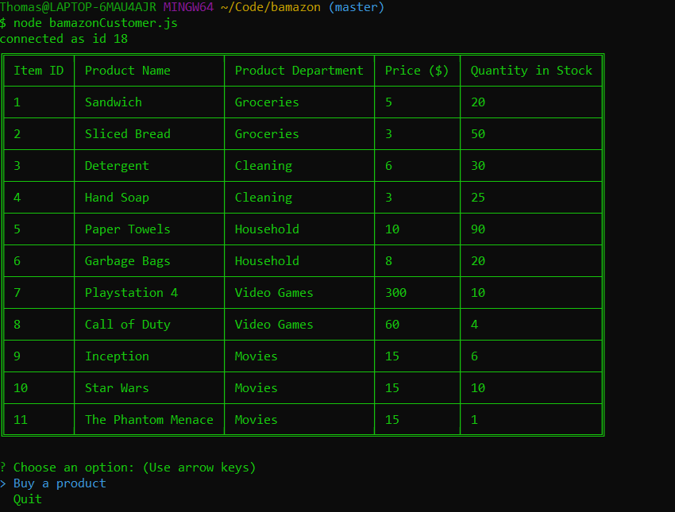
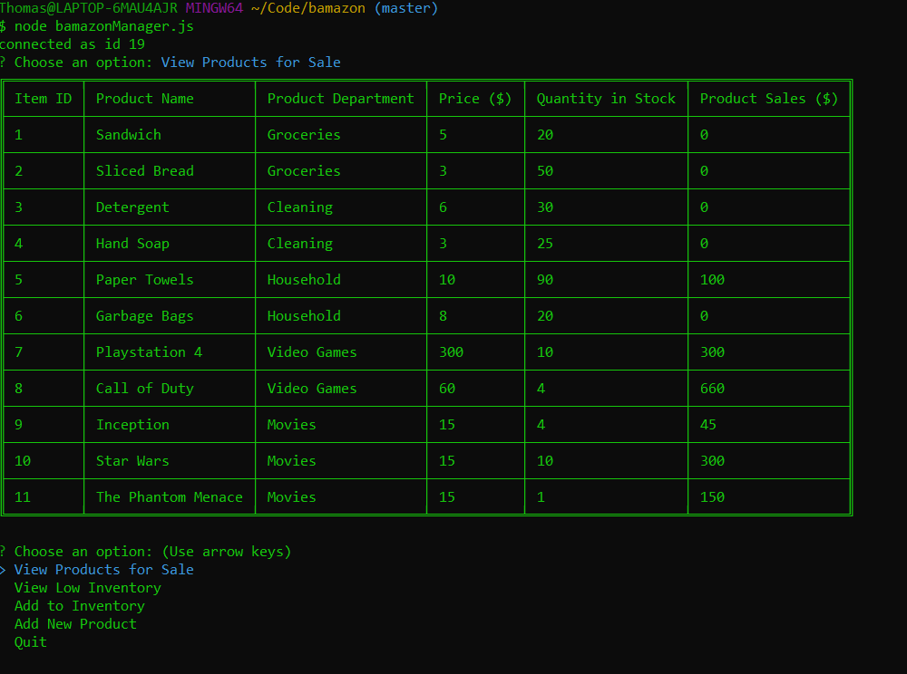

# bamazon

# Table of Contents
* [Requirements](#requirements)
* [Instructions](#instructions)
* [bamazonCustomer](#bamazonCustomer)
* [bamazonManager](#bamazonManager)
* [bamazonSupervisor](#bamazonSupervisor)

# Requirements
* Node
* NPM

# Instructions
1. Clone the repository.
2. Run `npm i` (this will install the inquirer, mysql, and table packages).
3. Run one of the applications by typing `node bamazonCustomer.js`, `node bamazonManager.js`, or `node bamazonSupervisor.js`.
4. Consult the sections below for examples of functionality for each application.

# bamazonCustomer

In this application you can place an order for an item.

The following appears when you run the application.

Upon selecting "Buy a product", you are prompted for a product id and a quantity. The application then tells you how much your purchase costs and then returns to the original prompt.

If you attempt to buy more of a product than is in stock, you will be greeted as shown below.

# bamazonManager

In this application, you can view all products, view only low inventory (less than 5 in stock), add stock to a product, or add a new product to the store.

The following appears when you run the application.

Upon selecting "View Products", you are greeted with the table shown below (note that the manager can see the product sales, unlike the customer). The application then returns to the initial prompt.

Upon selecting "View Low Inventory", you are greeted with the table shown below, the same as above but filtered to show only products with stock below 5. The application then returns to the initial prompt.

Upon selecting "Add to Inventory", you are prompted for a product id and an amount to add. The application tells you which product you are restocking before returning to the initial prompt.

Upon selecting "Add New Product", you are prompted for a name, department, price, and stock quantity. The application tells you the product that has been added and then returns to the initial prompt.

# bamazonSupervisor

In this application, you can view product sales by department or add a new department to the store.

The following appears when you run the application.

Upon selecting "View Product Sales by Department", you are greeted with the table shown below. The application then returns to the initial prompt.

Upon selecting "Add a department", you are prompted for a name and an overhead cost. The application tells you the department that has been added and returns to the initial prompt.

